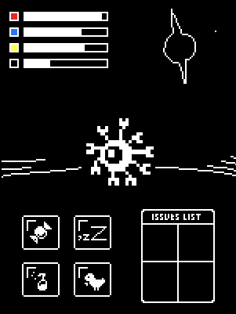

# Tamagotchi 16bits

A Tamagotchi-style game made with java

---

## Usage

### step 1

create a ./data folder in the path of the project to save the game data.


### step 2

compile

```bash
javac Main.java
```

### step 3

execute

```bash
java Main
```

---


